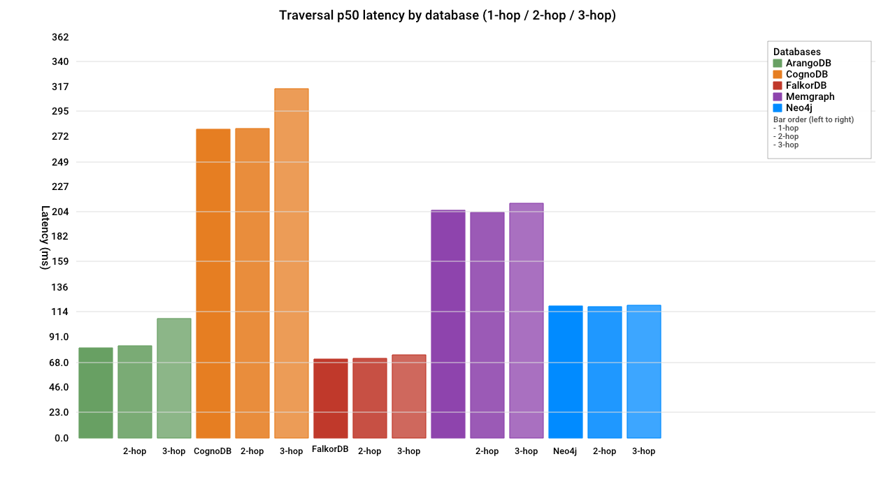
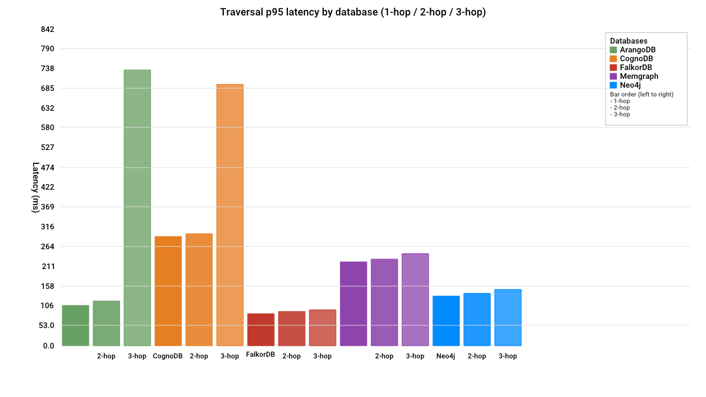
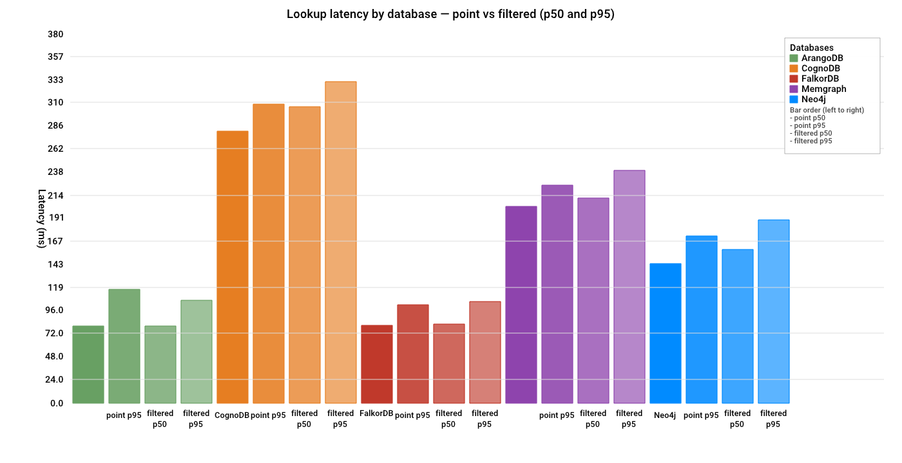
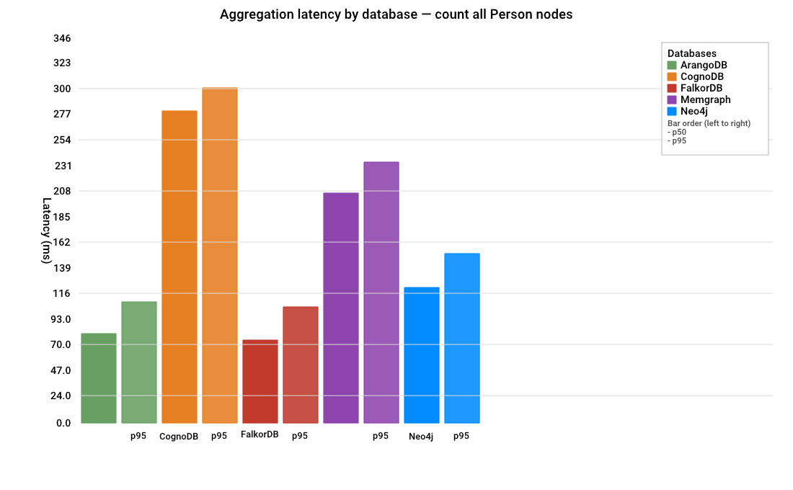
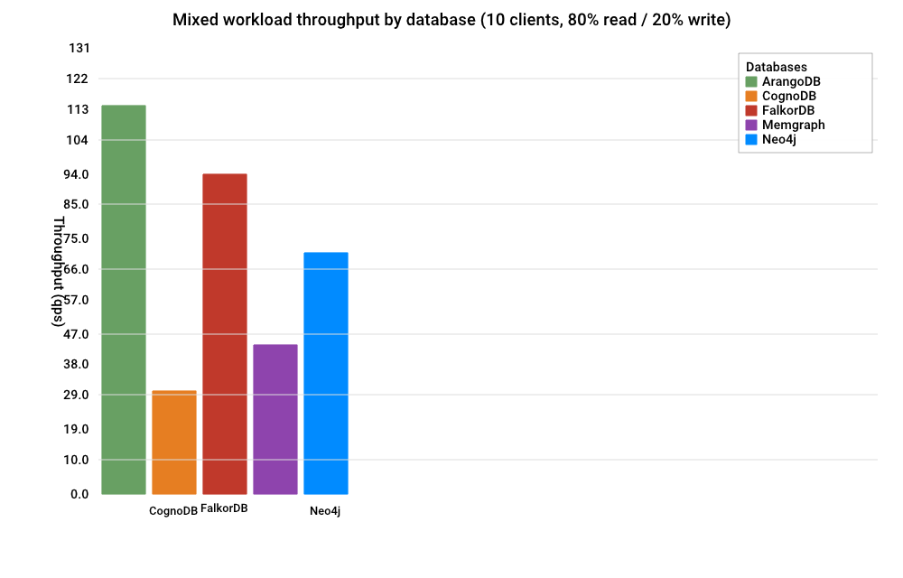
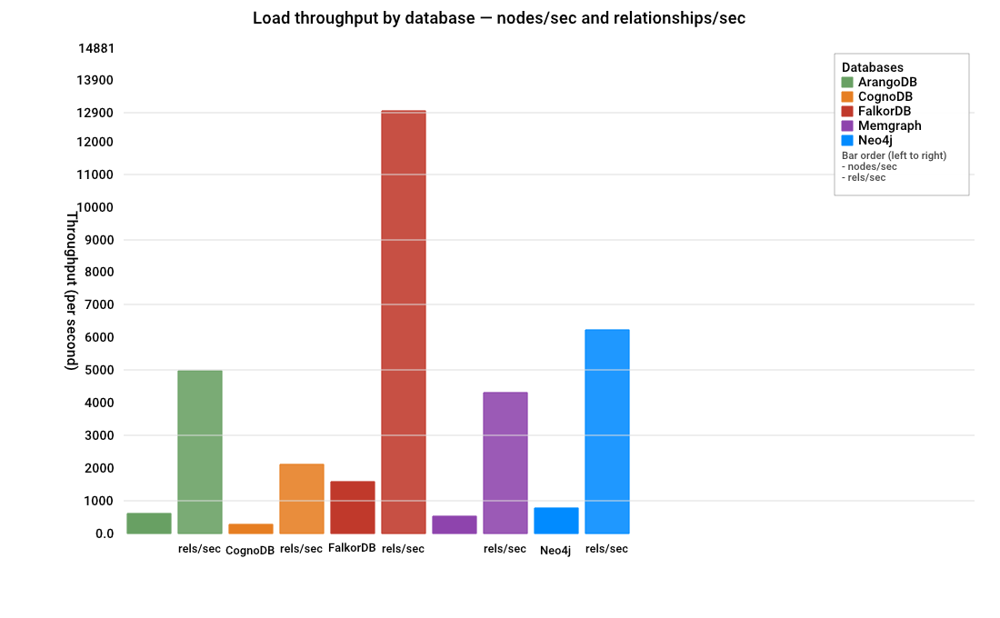
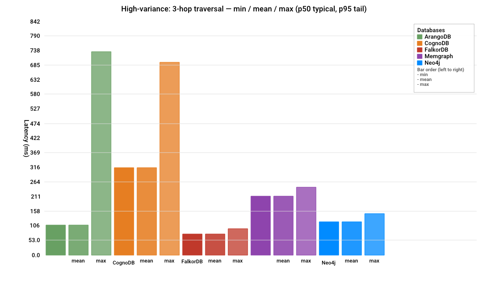

# Graph Database Cloud Benchmarking — CognoDB vs. Neo4j, Memgraph, FalkorDB, ArangoDB

## TL;DR

This benchmark runs CognoDB against four other graph databases — Neo4j, Memgraph, FalkorDB, and ArangoDB — on the same dataset, same queries, same test harness. The most surprising result: FalkorDB won on every single workload (traversals, lookups, aggregation, mixed reads/writes), despite running on a free tier with less than half the RAM of CognoDB and a fraction of what Neo4j gets. Read that as "smaller footprint doesn't mean slower," not as a final verdict on any of these databases. One thing to know before diving into the tables: the free-tier hardware across platforms isn't resource-equivalent, so the comparison below is fair in method but not in raw horsepower — that trade-off is explained in detail further down.

### Overview

This repository benchmarks CognoDB against four managed graph database platforms — Neo4j, Memgraph, FalkorDB, and ArangoDB — on an identical dataset, using identical workloads and a shared measurement framework. The goal is a fair, reproducible comparison, not a verdict on which database is "best." Every methodology decision below is documented so the results can be checked, and every limitation is stated rather than smoothed over.

### Databases Tested

| Database | Query Interface | Client Protocol |
|---|---|---|
| CognoDB | Cypher | Bolt |
| Neo4j Aura Free | Cypher | Bolt |
| Memgraph | Cypher | Bolt |
| FalkorDB | Cypher | RESP (Redis protocol) |
| ArangoDB | AQL | HTTP/VelocyStream |

FalkorDB is the one outlier worth naming up front: it supports Cypher like Neo4j and Memgraph, but it runs over Redis's RESP protocol rather than Bolt, so it needed a separate client library despite the shared query language. ArangoDB uses AQL instead of Cypher entirely. Both differences are handled by the framework design described below, not by giving either platform special-case treatment in the benchmark logic.

### Environment / Resource Tiers

Specs were pulled live from each platform's exposed limits, not from marketing copy.

| Platform | Verified Spec | vs. CognoDB Baseline |
|---|---|---|
| CognoDB | Free "c0" — 0.5 vCPU (burstable), 256 MB RAM, 1 GB disk | Baseline |
| Neo4j Aura Free | 4 vCPUs, ~6.4 GB RAM visible to the JVM | ~25x RAM |
| Memgraph Free | 1.54 GB memory limit | ~6x RAM |
| ArangoDB Trial | 1 vCPU, ~1 GB RAM, license expires ~13 days from creation | ~4x RAM, 2x vCPU |
| FalkorDB Free | 100 MB maxmemory | ~0.4x RAM (smaller than CognoDB) |

These tiers are not resource-equivalent, despite an attempt to keep them comparable. This is a deliberate, disclosed trade-off: managed free tiers generally don't let you resize down to match a smaller competitor's box, and CognoDB's 256 MB tier has no equivalent on most of these platforms. FalkorDB is the exception — its 100 MB free tier is the only one smaller than CognoDB's. See Analysis and Caveats for how this affects the results.

### Dataset

- Source: soc-Pokec (Slovak social network), Stanford SNAP dataset collection
- URL: https://snap.stanford.edu/data/soc-pokec-relationships.txt.gz
- Sample used: 26,259 nodes, 215,922 relationships — a connected sample taken by walking outward from a popular seed node, not a random slice, to preserve realistic local graph structure. This falls within the assignment's target range (100k–500k relationships).
- Loaded identically into all 5 platforms via each platform's native driver or import path (scripts/).

#### Load order and fairness rule

Platforms were loaded in a fixed, arbitrary order — alphabetical (ArangoDB, CognoDB, FalkorDB, Memgraph, Neo4j) — chosen mechanically, not based on any performance expectation.

Fairness rule: if any platform failed or struggled to load the full dataset because of free-tier limits, the dataset size would be reduced and reloaded identically on all five platforms — never left larger for some than others. This rule was triggered once: an initial sample targeting 300,000 undirected edges produced 4.2 million directed connections, which crashed ArangoDB's free tier. Rather than continuing with four platforms on the large sample and one on a smaller one, the load was stopped, the sample size reduced, and all five platforms reloaded from scratch on the current 215,922-relationship dataset.

#### Data-loss transparency

Each loader detects and reports relationships that fail to load — for example, rows with malformed source data or missing endpoint nodes. This count is written to results/load_logs/ for every platform, so a skipped edge is visible in the record rather than silently dropped. For the final dataset used in this benchmark, that count was zero on every platform except the ArangoDB re-load issue described in Caveats, which was a separate idempotency bug rather than malformed source data.

### Benchmark Framework & Methodology

One shared runner, five databases. All 5 platforms implement a common Database interface (internal/db/), and every workload runs through a single shared runner, timer, and percentile calculator (internal/bench/). This means every measurement — traversal, lookup, aggregation, mixed — follows the identical warm-up → measure → report sequence regardless of which database or query language is underneath. The alternative (five one-off scripts) risks inconsistent timing logic between platforms; this framework rules that out by construction.

Warm-up: 10 iterations by default before every measured run, excluded from all percentile math. Configurable per run, unchanged across this benchmark.

Measured iterations: 100 per read workload, per the assignment's stated minimum.

Percentile method: p50 and p95 computed via nearest-rank on the sorted list of successful latencies only — not averages, not interpolated. Failures are counted and reported separately (see Results) but excluded from percentile math by design, so a p50 figure should not be read as including error-path latency.

Seed-node fairness: the same 200 node IDs (sample_seed_nodes.csv), randomly selected from the full node set and rotated in the same order, are used for every seed-based workload on every database. This is what makes traversal, lookup, and aggregation numbers comparable across platforms — every database answers the same logical questions.

Hop definition (traversals): N-hop traversal = count of distinct nodes reachable within 1 to N hops outward from the start node, excluding the start node itself, following relationships in their stored direction. Applied identically in Cypher (CognoDB, Neo4j, Memgraph, FalkorDB) and AQL (ArangoDB). Before trusting any real numbers, a cross-language equivalence check ran the same start node's 1-hop query on two different databases and confirmed matching result counts — including a direct check against the source CSV for several seed nodes.

Lookup definition: point lookup = fetch by unique ID; filtered lookup = fetch by an indexed non-ID property (name, exact match). The same index shape (Person.id for point, Person.name for filtered) was confirmed present on all 5 platforms before measuring — no platform needed a new index added.

Aggregation: total count of Person nodes, same query intent on all 5 platforms.

Mixed workload: 10 concurrent clients, 500 total requests, 80% point-lookup reads / 20% node-create writes. Throughput reported as sustained queries/second, alongside p50/p95 latency, over a fixed request count.

Results schema: every result file follows the same structure — database, workload_name, category, iterations, warmup_iterations, p50_ms, p95_ms, failures, timestamp — so every table in this document reads from a single consistent format rather than per-workload ad hoc fields.

## Results

### Data Loading

| Database | Nodes/sec | Relationships/sec | Total Load Time |
|---|---|---|---|
| ArangoDB | 603.31 | 4960.85 | 43.53s |
| CognoDB | 257.40 | 2116.57 | 102.02s |
| FalkorDB | 1573.66 | 12939.86 | 16.69s |
| Memgraph | 522.50 | 4296.37 | 50.26s |
| Neo4j | 755.82 | 6214.92 | 34.74s |

ArangoDB's row is from the post-fix reload (results/load_logs/load_arangodb_20260807T173422Z.log); earlier buggy attempts aborted mid-run and have no completed load timing to compare.

### Traversals (ms)

| Database | 1-hop p50 | 1-hop p95 | 2-hop p50 | 2-hop p95 | 3-hop p50 | 3-hop p95 | Failures |
|---|---|---|---|---|---|---|---|
| ArangoDB | 80.8 | 107.1 | 83.1 | 118.5 | 107.8 | 732.6 | 0 |
| CognoDB | 278.5 | 289.8 | 279.4 | 297.3 | 314.9 | 694.6 | 0 |
| FalkorDB | 70.8 | 84.0 | 71.4 | 90.9 | 75.0 | 94.1 | 0 |
| Memgraph | 205.5 | 222.4 | 203.7 | 230.1 | 211.8 | 244.8 | 0 |
| Neo4j | 118.7 | 130.9 | 118.5 | 138.7 | 119.8 | 148.3 | 0 |

ArangoDB's figures are the post-fix, re-run numbers — see Caveats for the data-integrity issue found and corrected before these were accepted.

### Lookups (ms)

| Database | Point p50 | Point p95 | Filtered p50 | Filtered p95 | Failures |
|---|---|---|---|---|---|
| ArangoDB | 79.0 | 117.0 | 79.0 | 106.0 | 0 |
| CognoDB | 280.1 | 308.0 | 305.0 | 330.8 | 0 |
| FalkorDB | 79.8 | 100.8 | 81.2 | 104.7 | 0 |
| Memgraph | 202.4 | 224.1 | 211.2 | 239.8 | 0 |
| Neo4j | 143.5 | 172.3 | 158.2 | 188.6 | 0 |

### Aggregation — count all Person nodes (ms)

| Database | p50 | p95 | Failures |
|---|---|---|---|
| ArangoDB | 80.0 | 108.5 | 0 |
| CognoDB | 279.7 | 300.5 | 0 |
| FalkorDB | 73.9 | 103.7 | 0 |
| Memgraph | 205.9 | 233.9 | 0 |
| Neo4j | 121.5 | 152.0 | 0 |

### Mixed workload — 10 clients, 500 requests, 80% read / 20% write

| Database | QPS | p50 (ms) | p95 (ms) | Failures |
|---|---|---|---|---|
| ArangoDB | 114.1 | 80.6 | 144.5 | 0 |
| CognoDB | 30.1 | 312.9 | 343.1 | 0 |
| FalkorDB | 94.0 | 78.3 | 104.0 | 0 |
| Memgraph | 43.7 | 207.3 | 231.2 | 0 |
| Neo4j | 70.8 | 127.3 | 160.8 | 0 |

### Charts

PNG charts are generated from `results/aggregated_summary.json` (same figures as the tables above) by `go run ./cmd/chart`. Each platform uses a fixed color on every chart.















The variance chart is for 3-hop traversal, the workload flagged for a wide typical-vs-tail gap (ArangoDB p95/p50 ≈ 6.8×, CognoDB ≈ 2.2×). Bars show min / mean / max; with a single measured run those are p50 / p50 / p95.

### Footprint

Live probe against all five platforms after the final load. Node count was
26,361 at probe time (215,922 relationships unchanged) — the +102 nodes above
the original 26,259 are leftover writes from the mixed workload benchmark,
consistent with the caveat below.

| Database | Disk / store size | Memory usage |
|---|---|---|
| CognoDB | not observable | not observable |
| Neo4j | not observable | ~1.95 GB JVM heap used (max ~3.00 GB) — instance-wide, not dataset-specific |
| Memgraph | 33.74 MiB (`SHOW STORAGE INFO`) | 36.98 MiB tenant-tracked (`SHOW MEMORY INFO`) |
| FalkorDB | not observable as disk (in-memory) | 14 MB graph size (`GRAPH.MEMORY USAGE`); 24.3 MB Redis `used_memory` (100 MB limit) |
| ArangoDB | ~48 MB (`documentsSize` + indexes, via `/figures`) | not observable on the trial API |

CognoDB and Neo4j don't expose dataset-level size through any procedure or JMX
bean available on their free/trial tiers — only cumulative counts are visible.
Memgraph and FalkorDB expose the most granular figures of the five. ArangoDB
exposes collection-level disk size but not process memory. Where "not
observable" is reported, this was confirmed by checking for the platform's
standard introspection commands, not assumed.


## Analysis

The most useful number in this whole report isn't which database was fastest — it's that the fastest one, FalkorDB, had the least RAM to work with.

The ranking holds across all four workload types. FalkorDB and ArangoDB were consistently the fastest platforms; CognoDB was consistently the slowest; Neo4j and Memgraph sat in between. A pattern repeating across four independent query types — traversal, lookup, aggregation, mixed — is a stronger signal than any single benchmark result on its own.

That ranking doesn't map cleanly onto available memory. FalkorDB's free tier has less RAM than CognoDB's (100 MB vs. 256 MB), yet it was the fastest platform tested on every workload. That's the more interesting finding here — a smaller resource footprint outperforming a larger one suggests the gap is not simply "more RAM wins." Neo4j is the platform to read most cautiously in the other direction: it holds roughly 25x the RAM of CognoDB, so its results should be read as "fast, with generous headroom," not purely as "fast because of a more efficient query engine." The resource table above should sit next to every ranking claim in this section for that reason.

1-hop and 2-hop latency were nearly identical on every platform. This points to network/connection round-trip time dominating over actual query execution at this dataset size and hop depth, rather than the query engines doing meaningfully more work at 2 hops than at 1.

3-hop tail latency stood out on two platforms. ArangoDB (p50 107.8ms → p95 732.6ms, ~7x) and, to a lesser degree, CognoDB (p50 314.9ms → p95 694.6ms, ~2.2x) showed a wide gap between typical and worst-case 3-hop latency. This was checked against the ArangoDB data-integrity issue below and persisted after that was fixed, which indicates it's a real property of the dataset — some of the 200 seed nodes have substantially larger 3-hop neighborhoods than others, and the widest ones dominate the tail.

Zero failures across all 65 benchmark runs (13 workload/hop combinations × 5 databases), including under the 10-client concurrent mixed workload.

### Caveats and Known Limitations

- Free-tier hardware is not resource-equivalent across platforms, despite an attempt to keep tiers comparable (see Environment table above). This is disclosed, not hidden, and factored into the Analysis section rather than presented as if resources were equal.
- ArangoDB data-integrity issue, found and fixed. A pre-benchmark audit found ArangoDB held 217,922 relationships instead of the correct 215,922 present in the source file and all other four databases. Root cause: the ArangoDB loader used a blind INSERT with overwriteMode: update but no deterministic edge key, so a failed partial load (503 timeout, ~57k edges written before abort) left remnants that a later, successful full load stacked on top of — producing 49 true duplicates and 1,951 dangling foreign edges. Fixed by introducing a deterministic edge key, switching to UPSERT, and adding a unique index on (_from, _to) (commit be7f6e1). ArangoDB's traversal benchmarks were re-run against the corrected dataset before being included in this report; the other four databases were never affected.
- ArangoDB's tier is a 13-day trial, not a permanent free tier. Anyone reproducing this benchmark later should expect to provision a fresh trial, and should expect some drift in exact specs across all five platforms over time, since these were pulled live rather than assumed.
- Filtered lookup is an exact match on name, not a free-text or fuzzy search — this is not a full-text search benchmark.
- Mixed-workload writes leave real nodes behind. The write portion of the mixed workload creates mixedbench-… nodes that remain in each database afterward. Node counts will differ from the original 26,259 if re-checked post-benchmark; this is expected, not a data-integrity issue.
- A connectivity ping is not a query benchmark. CognoDB's raw connectivity check can report latency near 0ms — that measures a trivial round-trip, not real query cost, and could create a false impression of speed if mistaken for a benchmark result. Every number in the Results section above is real query latency, validated against an actual database via the framework's self-check (see below) before being trusted.

## Code Quality & Reproducibility

- Smoke test: a fast per-database reachability check (cmd/smoketest) confirms all five databases are reachable and responding correctly before committing to a full data load — useful for anyone re-running this benchmark to catch a bad connection early rather than after a long import.
- Framework self-check: demo/benchdemo validates the runner's warm-up separation and percentile math against a real database before any Phase 5 result is trusted. Its output is written to demo/results/, kept separate from results/, and clearly labeled so it can't be mistaken for a real benchmark result.
- Cleanup pass: dead code (an unused internal/workload stub, an unused loader.Clean() function) and internal-only planning comments were removed before submission, and demo/self-check artifacts were relocated out of results/ so they can't contaminate real output. .env is git-ignored and confirmed never committed (verified via git log and git grep across tracked history).
- All credentials are environment-only, read via internal/db/registry.go (*_URI, *_USER, *_PASSWORD). No password, URI, or embedded credential is committed anywhere in the repository or its history.

## How to Run

```
# 1. Copy the environment template and fill in credentials for all 5 databases
cp .env.example .env

# 2. Load the dataset into all 5 databases
./scripts/load_all.sh

# 3. Run the full benchmark suite
go run ./cmd/bench_traversal
go run ./cmd/bench_lookup
go run ./cmd/bench_agg_mixed

# 4. Generate PNG charts from results/aggregated_summary.json
go run ./cmd/chart

# Results are written to results/bench_<category>_<db>_<timestamp>.json
# Charts are written to results/charts/*.png
```